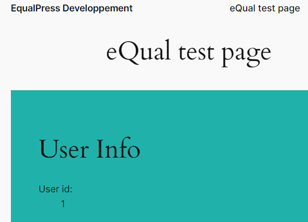

# eQual - Run

Contributors: (this should be a list of wordpress.org user IDs)

Tags: comments, spam

Requires at least: 4.5

Tested up to: 6.5

Requires PHP: 7.4.33

Stable tag: 0.1.0

License: GPLv2 or later

License URI: https://www.gnu.org/licenses/gpl-2.0.html

Load the eQual library and initialize the necessary dependencies.

## Description

eQual - Run is a WordPress plugin designed to handle eQual requests efficiently. It integrates with the eQual library to
manage various functionalities related to eQual. This plugin facilitates the seamless integration of the eQual framework
within WordPress by loading the `eq.lib.php` file and initializing the necessary dependencies.

## Features

- Load the eQual library and initialize the necessary dependencies.

## Hooks and Filters used

- init
- admin_menu

## Installation

This section describes how to install the plugin and get it working.

1. Upload `eq-run.zip` to the `/public/wp-content/plugins/` directory or install it via the WordPress plugin manager.
2. Activate the plugin through the 'Plugins' menu in WordPress.

## Frequently Asked Questions

This section is currently empty.

## Screenshots

## Changelog

### 0.1.0

- Initial release of eQual - Run plugin.

## Upgrade Notice

No upgrade notices available.

## Arbitrary section

This section is currently empty.
